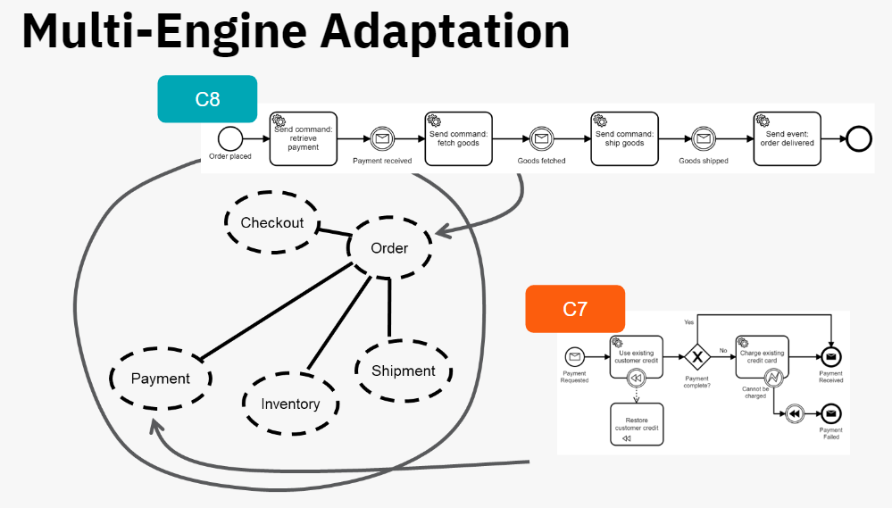
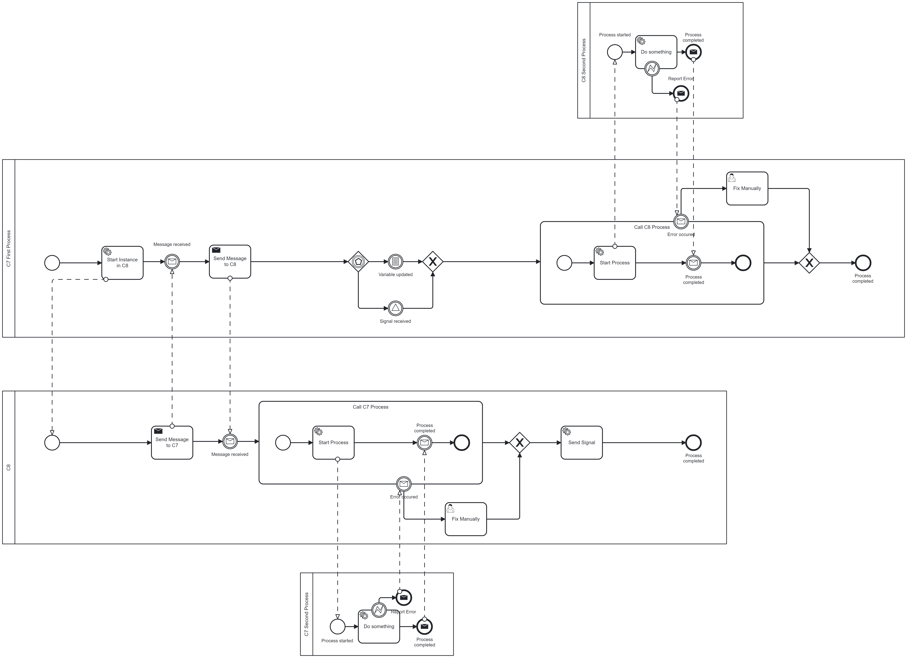
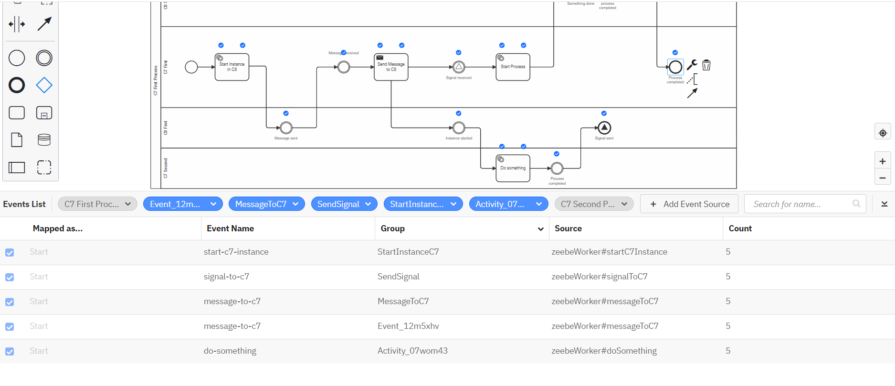
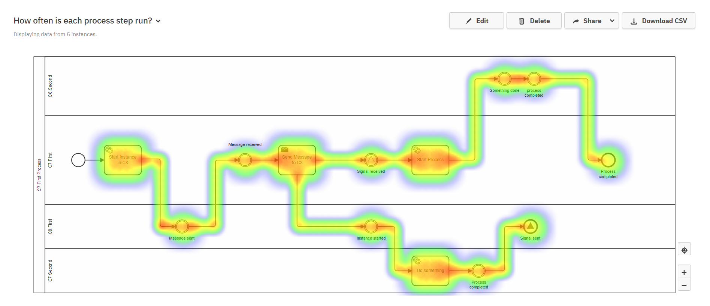

# Multi Engine Adaptation C7 - C8



## Project Overview

The project entails a partial transition to Camunda 8, offering substantial advantages. It involves adopting a Multi-Engine architecture where both Camunda 7 (c7) and Camunda 8 (c8) coexist and intercommunicate through APIs.

**Process Diagram**:


### Key Objectives

- **Enhanced Flexibility:** Utilizing the features of Camunda 8 to introduce greater flexibility into the system.

- **Partial Migration:** Implementing a phased migration approach to gradually transition to Camunda 8 while preserving existing functionality.

- **Prioritized Implementation:** Strategically prioritizing the migration based on feature availability and specific requirements.

### End-to-End Visibility with Optimize

The Ingest API in Camunda Optimize (C7 Feature only) allows to:

- Enables a unified view of processes and activities across the organization.
- Supports cross-platform analytics and visualization.
- Facilitates process optimization and data-driven decision-making.

Via the Ingestion API we can send Camunda 8 Events to Optimize.

#### Implementation in a gRPC Client Interceptor

Camunda 8 Events are send to Optimize via a Interceptor. Following steps are happening:

1. **Initialize gRPC Client Interceptor:**
   [Set up a gRPC client interceptor](./src/main/java/org/camunda/consulting/example/interceptor/InterceptorConfiguration.java) for custom logic in outgoing calls.

2. **Capture Job Information:**
   Capture relevant job data when a [job is activated](./src/main/java/org/camunda/consulting/example/interceptor/OptimizeEventInterceptor.java) in a job worker.

3. **Prepare Data for Ingestion:**
   Aggregate essential data (e.g., job ID, process instance ID) for ingestion into Camunda Optimize. As a traceId, a variable with the name correlationKey is used. The correlationKey maps to the business key in Camunda 7.

4. **Ingest Data into Camunda Optimize:**
   Utilize the Ingest API endpoints to send a POST request with the prepared data.

These steps facilitate efficient integration of the Ingest API, enabling seamless transmission and analysis of job-related data in Camunda Optimize.

#### See Events in Optimize

You need to enable Event Based Processes in Optimize:

```
engines:
  'camunda-bpm':
    eventImportEnabled: true

eventBasedProcess:
  authorizedUserIds: ['demo']
  authorizedGroupIds: []
  eventImport:
    enabled: true
```

Now the ingested events are visible in Optimize

1. Create BPMN Diagram

2. Map Events



3. Create Reports



#### Limitations

- Only ActivateJob Events will be send to Optimize (No BpmnError, No Engine Events (Timer, Message received, ...))
- ActivatedJobs will be reported to Optimize, even if the completion fails


## What you need to run the project

- Camunda License Key (including Optimize) (update in [license.txt](./docker/license.txt))
- Camunda EE Images (You can also use Camunda Run CE. Optimize requires an Enterprise License)

```
docker login registry.camunda.cloud
Username: my.username
Password: my.pw

Login Succeeded
docker pull registry.camunda.cloud/cambpm-ee/camunda-bpm-platform-ee:run-7.19.6
docker pull registry.camunda.cloud/optimize-ee/optimize:3.10.5
```

```
docker compose up
```

```
mvn spring-boot:run
```


## Start an Instance

```
curl --location 'http://localhost:8080/engine-rest/process-definition/key/C7_First/start' \
--header 'Content-Type: application/json' \
--data '{
    "variables": {
        "payload": {
            "value": "Hello",
            "type": "String"
        }

    },
    "businessKey": "1235555x"
}'
```