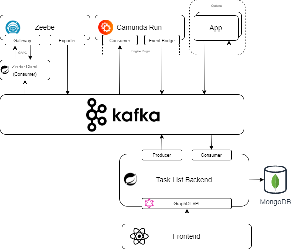

# Custom Tasklist for User Tasks (Camunda 7 and 8)

## Components

### C8
#### Exporter
[Exporter Module](./c8-exporter/)
Exporting User Tasks and Deployment Events to Kafka.
#### Job Worker
[Job Worker Module](./c8-jobworker/)
Job Worker for topic "io.camunda.zeebe:userTask".
Includes Kafka Listeners to complete UserTasks, once message is received.

### C7
#### Engine Plugin
[C7 Exporter](./c7-exporter/)

### Tasklist
#### Backend
[Tasklist Module](./tasklist/)
Spring Boot Application with GraphQL API

#### Frontend
[Frontend](./tasklist/client/)
Written in React

## How to run this project
``
mvn clean install
``

``
docker compose up
``

Exporter and Engine Plugin jars need to be mounted to the respective Engine.
For the Tasklist & Tasklist Worker Docker Images are available:
- [Tasklist](https://hub.docker.com/repository/docker/camundomanu/tasklist/general)
- [Tasklist Worker](https://hub.docker.com/repository/docker/camundomanu/tasklist-worker/general)

The Docker Compose File also includes Components that are not required, but helped me a lot during development.
- mongo-express
- provectuslabs/kafka-ui
