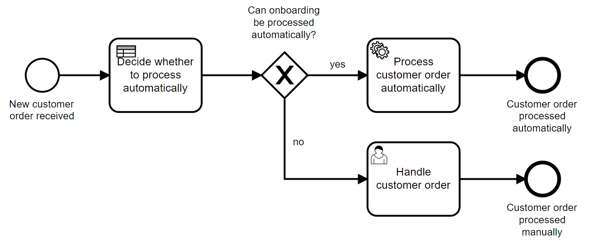
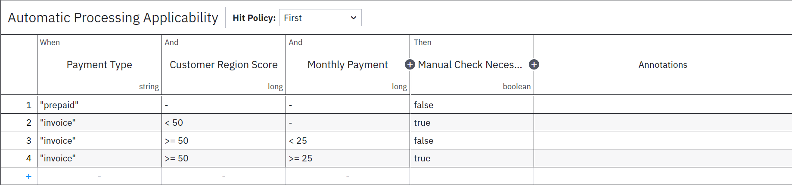

# Camunda 8 Spring Boot Process Solution Showcasing DMN

This example implements a customer onboarding example from [Practical Process Automation](https://processautomationbook.com/), chapter 4:



The decision if a customer order can be processed automatically is made by this decision table:



This self-contained process solution contains

* The process model as BPMN (auto-deployed during startup)
* The decision model as DMN (auto-deployed during startup)
* No-op glue code for the service task
* REST endpoint that then starts a process instance
* Test case
* The project starts two process automatically on startup (to make them ready for inspection)

Requirements:

* Camunda 8
* Java >= 17
* Maven

## How to run

* Download/clone the code in this folder.
* You need to set your Camunda cloud client connection details in the file `application.properties`. Simply replace the existing sample values.
* Run the application:

```
mvn package exec:java
```

```
curl -i -X PUT http://localhost:8080/customer
```

TODO: Currently data is not taken from REST request but hardcoded, should be added ``--header "Content-Type: application/json" --data '{"username":"xyz","password":"xyz"}'``

* You should see something like this:

```
AUTOMATIC PROCESSING HAPPENING
```
