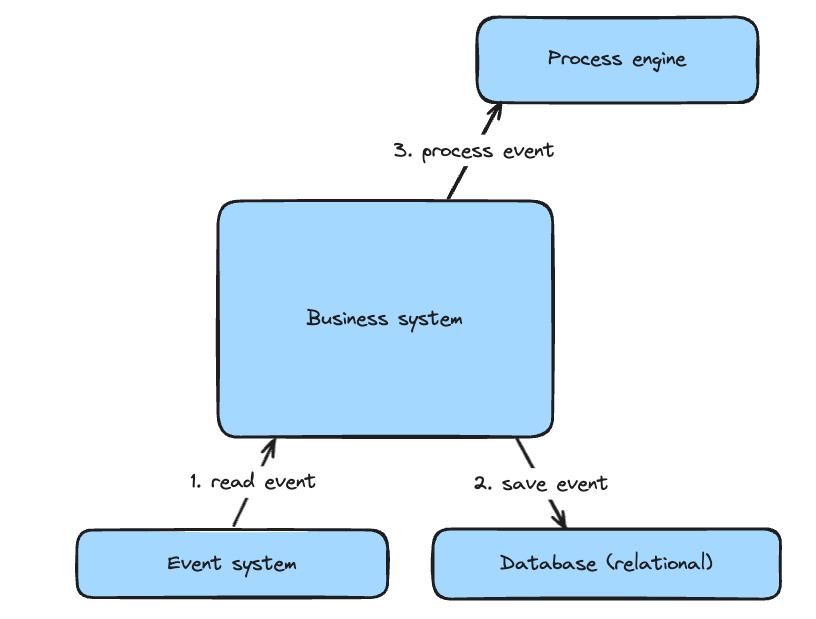
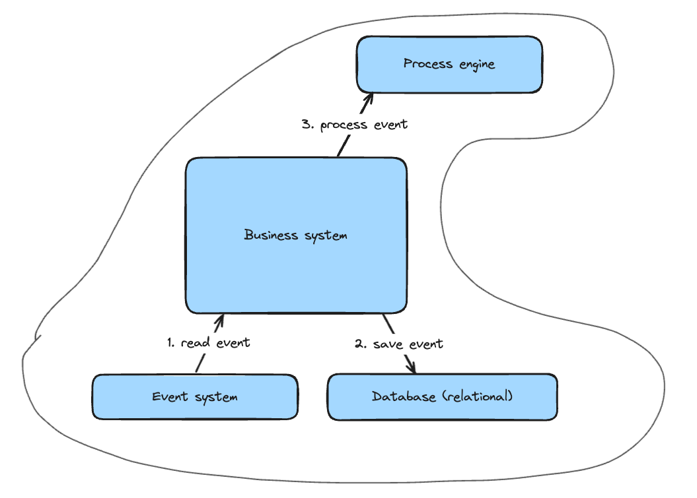
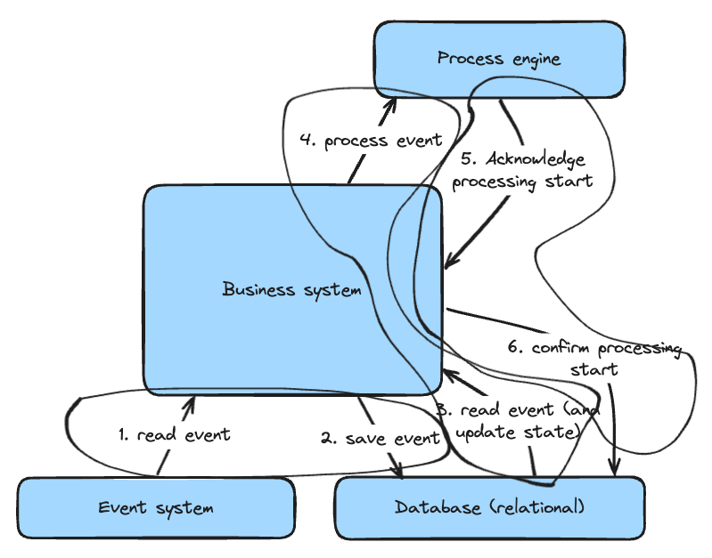

# Event processing

## Scenario

This example shows how you can achieve consistency using this architecture:



An event is received via event system (RabbitMQ, Kafka, ...) and should first be saved to the business systems' database (a relational database in this case).

Then, the processing should start.

### The easy way



These 3 steps cannot happen in a transactional way (as Camunda does not support transaction contexts, and maybe some event system does not as well).

Now you can of course implement it like this and accept the risk that an event is read from the event system, saved to the database, but not processed.

### The correct way



While the likelihood that errors happen here is really low (most runtimes prevent shutdown while threads are active), it can still occur (SIGTERM or power outage).

The same architecture can have an event handled in 3 independent steps:

1. The event is read from the event system and saved to the database in the initial state (`CREATED`)
2. An event in the initial state is read from the database and published to the process engine, then its state is updated to `PUBLISHING`. The same step can happen to events being in this state for too long (coordinated with the message timeout)
3. The published event triggers a callback hook that sets the events' state to `PUBLISHED`, confirming that the event has been captured by the process engine and is now being processed.

All of these steps are idempotent, so they can be implemented with an at-least-once logic. This means that:

1. The read from the event system can happen multiple times without changing the event that has been captured once
2. The publishing of the event can be repeated as it relies on zeebe messaging pattern
3. The acknowledgement of the publishing can be repeated as this is the last state change happening to the event

### Implementation

This implementation simulates the event system with a rest api that allows for submitting events:

```
POST /events

{
  "id": "123",
  "name": "random",
  "content": {
    "foo": "baz"
  }
}
>>>
{
  "id": "123"
}
```

* `id`: Each event consists of an id. This is the unique identifier for a specific event. An event with an `id` can only be saved once, allowing for idempotency. This id will be used as correlation key and message id when publishing a message to zeebe. On top, it is set as variable `eventId`
* `name`: Each event has a name that will be used as message name when publishing a message to zeebe.
* `content`: Finally, each event has a content that is a JSON object without fixed schema. This is set as variable `content`

A message event that should be able to work with the event processor should:

* define a message name that matches the events' name
* if not a start event, define a correlation key that matches the events' id
* have an end listener with the job type `correlated`

Now, an event can be published and its state can be tracked with the rest api:

```
GET /events/{event-id}

>>>
{
  "id": "123",
  "name": "random",
  "content": {
    "foo": "baz"
  },
  "state": {
    "name": "PUBLISHED",
    "createdAt": "2024-12-12T14:51:28.945495+01:00",
    "publishingAt": "2024-12-12T14:51:29.040717+01:00",
    "publishedAt": "2024-12-12T14:51:29.140717+01:00"
  }
}
```

### Setup

Prerequisities:

Only a running zeebe engine is required. By default, the zeebe client points to the gateway running on port 26500, so you use either [C8Run](https://docs.camunda.io/docs/self-managed/setup/deploy/local/c8run/) or the [docker-compose](https://docs.camunda.io/docs/self-managed/setup/deploy/local/docker-compose/) setup.

To run the example, just execute:

```shell
mvn spring-boot:run
```

To connect against another cluster (saas for example), you can adjust the application.yaml according to [this guide](https://docs.camunda.io/docs/apis-tools/spring-zeebe-sdk/getting-started/).
