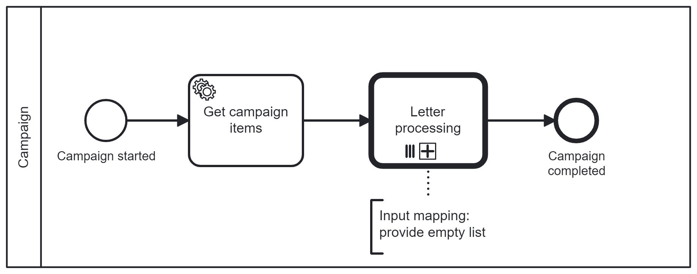
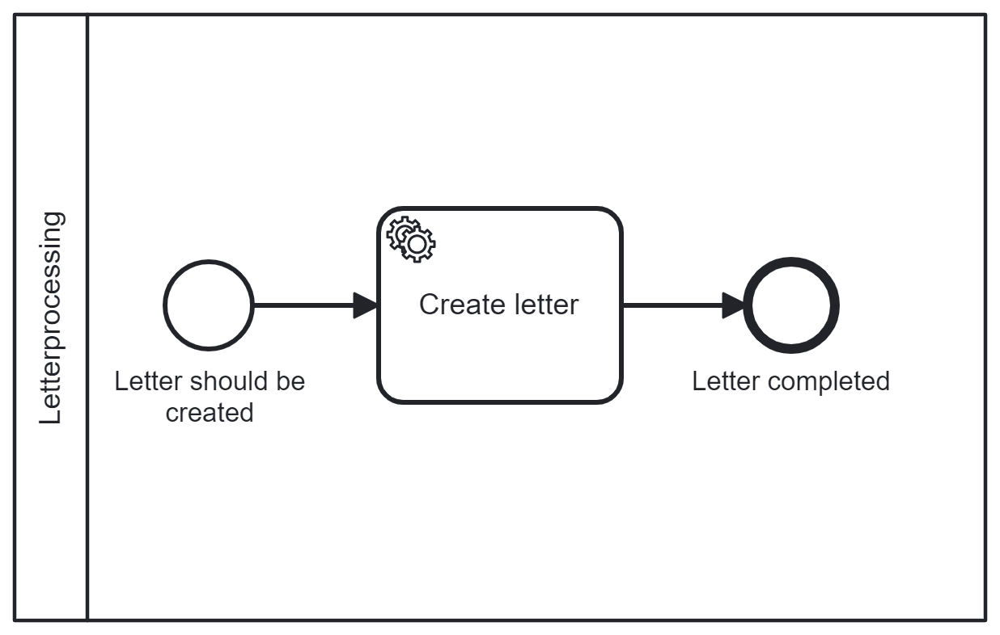
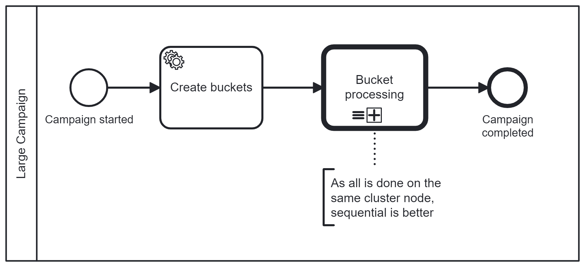
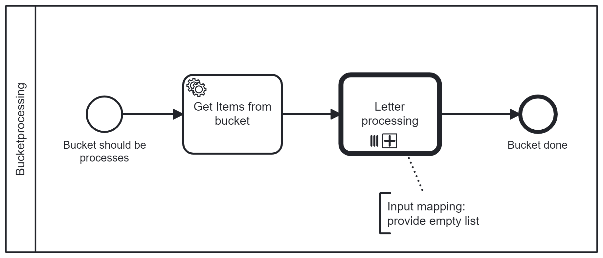
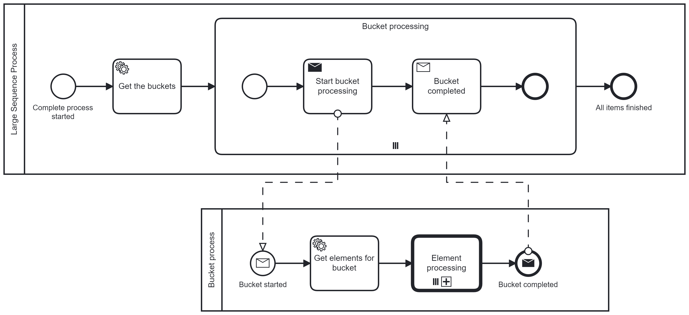
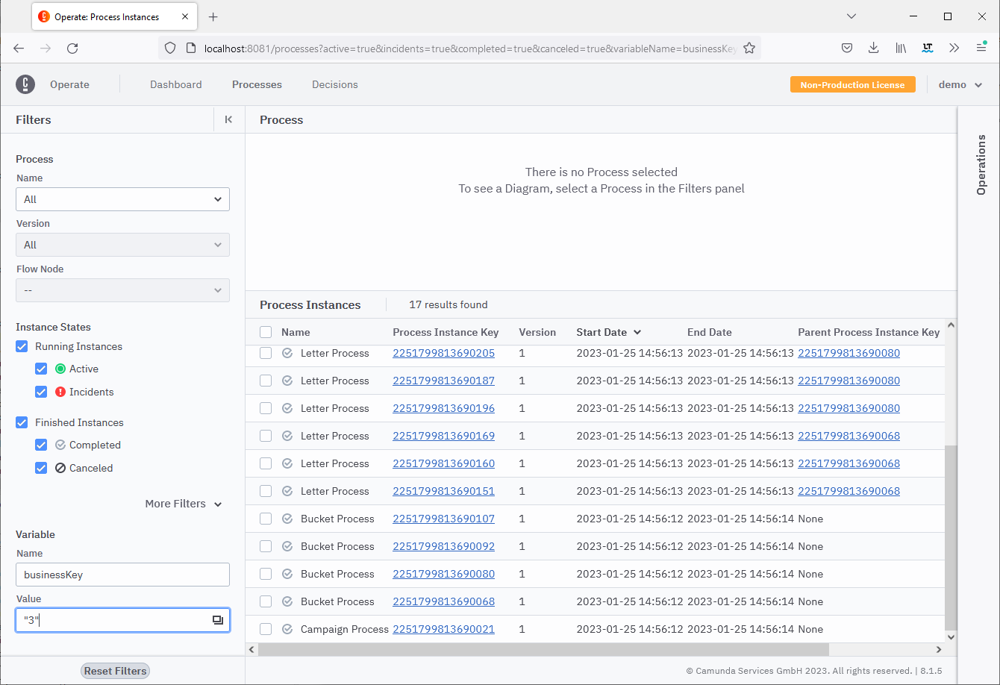
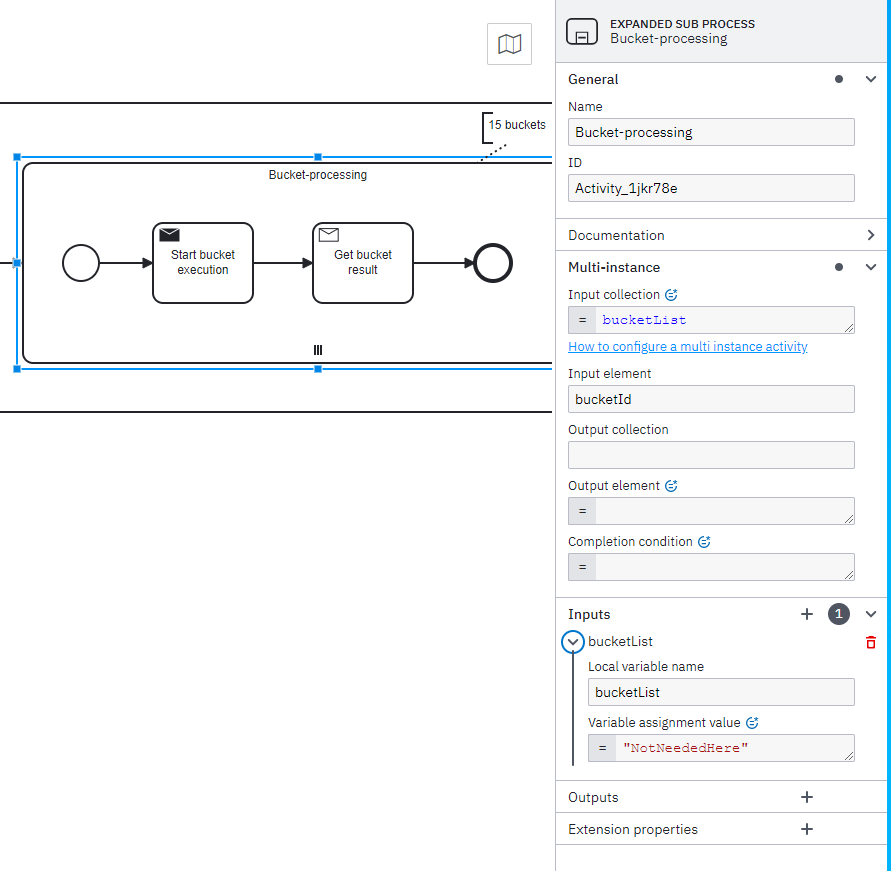

# Multi-instance Processing of a (Very) Large Sequence

Example to show concepts for processing a very large sequence of entities with a
multi-instance subprocess.

## Multi instance handling

This is possible now (Jun 2023) much better than before. The example completed
with 40.000 letters to send in about 22 minutes on a self-managed Camunda 8
installation with 3 nodes. Don't take the number as given, it depends highly on
the amount of data you are dealing with. Check the blog post for further details
of Zeebe-internal improvements:
https://zeebe-io.github.io/zeebe-chaos/2023/06/02/Using-Large-Multi-Instance/

These are the simple process models:

The example doesn't collect the elements from the multi-instance processing. The
results are saved as IDs in the lowest level letter process, that creates just a
single letter.

## Process modeling for large sequences

For a collection with more than 40.000 elements, you have to split the sequence
into smaller chucks and wrap another multi-instance around the letter
processing. In the example, you first create buckets, where each bucket can
contain a collection of 40.000 elements. The outer multi-instance should be a
sequential multi-instance as everything is running on a single node of the
cluster.

This is the new Campaign process:

And the Bucket process looks like Campaign process from the beginning:

The Letter process is the same for all examples.

## Process modeling for huge sequences

The examples above are all handled in a single node of the cluster.

If you have a huge sequence of items to process, you can use messaging to
distribute the load over all cluster nodes.

A variable called `businessKey` helps to identify all processes that belong to a
single campaign.

## Implementation

To minimize the data load per element, some additional modeling hints will help.

In the super process, only you will get the begin and end indexes for each
bucket.

In the multi-instance scope, you can overwrite the list with a dummy value via
an input mapping. Otherwise, the complete list will be passed to the subprocess.
This is a huge overload, as from now on only the element of the multi-instance
is required.

In the first subprocess, create the list of items, that should be handled in the
multi-instance call activity.

In the inner multi-instance call activity, you should again overwrite the list
variable with a dummy value.

## Return results from the multi-instance call activity

In case you want to collect the results from the multi-instance call activity,
you have to configure the output mapping correctly and only return the collected
result.

Have a look at the example process:
[multi-instance-simple-example process model](src/test/resources/multi-instance-simple-example.bpmn)

It is covered in a
[Spring Zeebe Test](src/test/java/com/camunda/consulting/SimpleMultiInstanceTest.java)

If you naively return all variables to the super process, you will get race
conditions:
https://github.com/camunda/zeebe/issues/11476#issuecomment-1434292730
