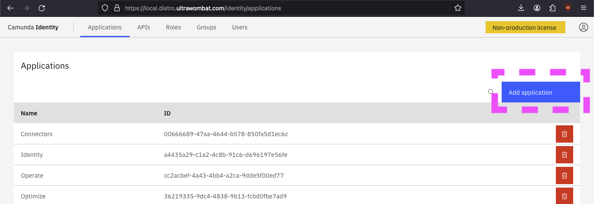
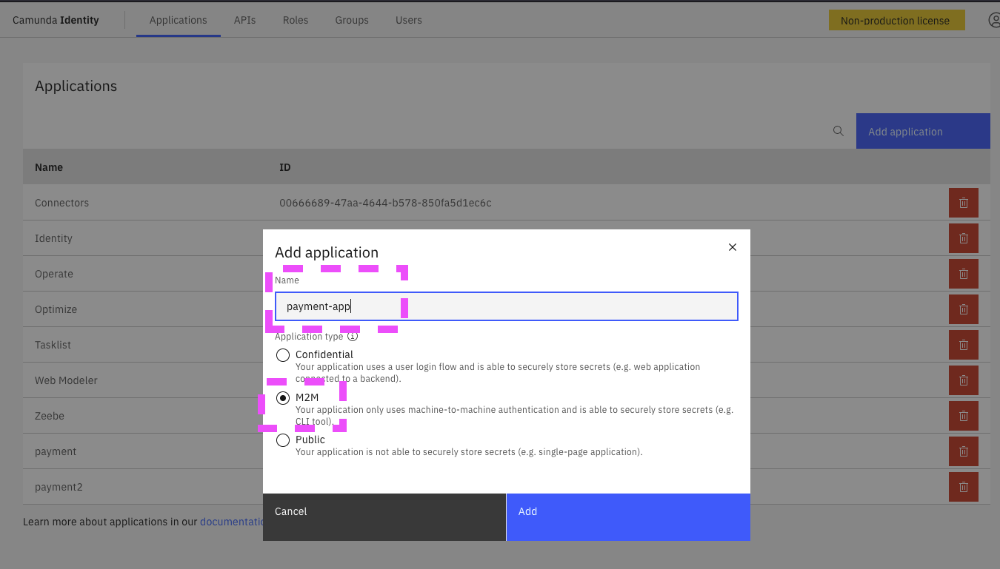
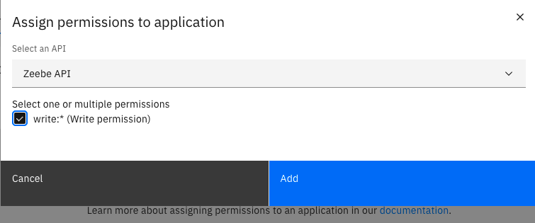
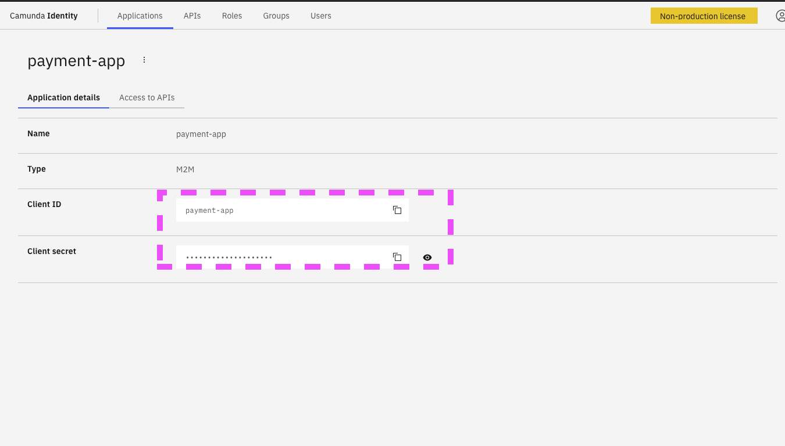
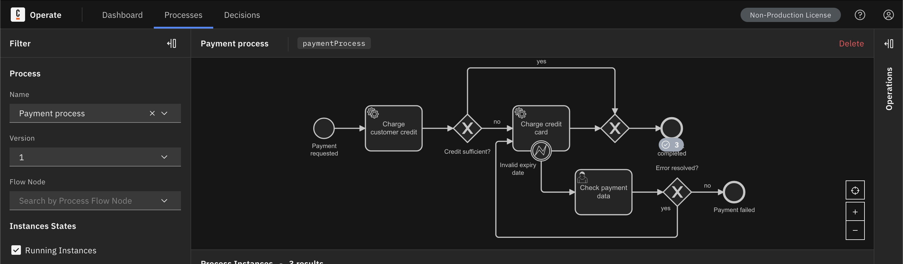

# Tutorial: Deploying an Application on C8 Platform (kubernetes)

## Introduction

In this tutorial, we'll walk you through deploying an application on the C8 platform using Kubernetes.

## Prerequisites

Throughout the tutorial, we'll use `kubectl` to perform administrative tasks on the cluster. If this is not part of your toolkit, please refer to the installation instructions available on [Kubernetes Documentation](https://kubernetes.io/docs/tasks/tools/).

## 1. Verifying Platform Installation

The first step is to ensure that the C8 platform has been deployed successfully. 
Let's list the pods in the namespace where you installed the platform:
```bash
kubectl get pods -n <c8-namespace>
```

You should ensure that all listed pods display a complete READY status.
For example, after running the command, you might see output similar to:

```text
NAME                                              READY   STATUS       RESTARTS        AGE
camunda-platform-elasticsearch-master-0           1/1     Running      1 (3d16h ago)   3d17h
camunda-platform-identity-56bdc66dd6-wqw77        1/1     Running      1 (3d16h ago)   3d17h
camunda-platform-keycloak-0                       1/1     Running      1 (3d16h ago)   3d17h
camunda-platform-operate-59c6b564cc-hc5l4         1/1     Running      1 (3d16h ago)   3d17h
camunda-platform-postgresql-0                     1/1     Running      1 (3d16h ago)   3d17h
camunda-platform-tasklist-647b8b9fb5-hlj7d        1/1     Running      1 (3d16h ago)   3d17h
camunda-platform-zeebe-0                          1/1     Running      1 (3d16h ago)   3d17h
camunda-platform-zeebe-gateway-796c8885d5-85hnm   1/1     Running      1 (3d16h ago)   3d17h
```

The list may vary depending on your installation, but it should be consistent with the components you chose to install (refer to [C8 Platform Overview](https://academy.camunda.com/c8-platform-overview)).

Ensure that all listed pods display a complete **READY** status.

## 2. Creating a Namespace for Application Installation

Your applications should adhere to Kubernetes' principle of separation and isolation. For this example, the application corresponds to users different from those who are administrators.

```bash
kubectl create namespace c8-payment-demo
kubectl config set-context --current --namespace=c8-payment-demo
```

By creating a dedicated namespace for application installation, we ensure proper isolation and organization within the Kubernetes cluster. We will now use this namespace in the tutorial.

## 4. Generating an M2M Token for Our Application

To enable communication with Zeebe, any application needs an authentication token if the authentication layer is enabled. The **Identity** component ([documentation](https://docs.camunda.io/docs/self-managed/identity/what-is-identity/)) is responsible for managing this authentication.

<details>
  <summary>How to get the Identity URL?</summary>

To obtain the Identity URL, retrieve the ingress of the platform:

```bash
kubectl get ingress -n camunda-platform   
```

This command provides a list of ingresses:

```text
NAME                             CLASS   HOSTS                                ADDRESS         PORTS     AGE
camunda-platform                 nginx   local.distro.ultrawombat.com         10.96.189.147   80, 443   3d18h
camunda-platform-zeebe-gateway   nginx   zeebe.local.distro.ultrawombat.com   10.96.189.147   80, 443   3d18h
```

In Kubernetes, an ingress exposes internal HTTP and HTTPS services outside the cluster. Note that there are multiple listed ingresses, one dedicated to the Zeebe Gateway and another to other services. We are interested in the latter, which hosts most of the C8 platform services.

To introspect the ingress and obtain the route associated with the Identity service:

```bash
kubectl describe ingress camunda-platform -n camunda-platform
```

This command provides details about the ingress:

```text
Name:             camunda-platform
Namespace:        camunda-platform
Address:          10.96.189.147
Ingress Class:    nginx
Default backend:  <default>
TLS:
  camunda-platform terminates local.distro.ultrawombat.com
Rules:
  Host                          Path  Backends
  ----                          ----  --------
  local.distro.ultrawombat.com  
                                /auth       camunda-platform-keycloak:80 (10.244.1.7:8080)
                                /identity   camunda-platform-identity:80 (10.244.1.5:8080)
                                /operate    camunda-platform-operate:80 (10.244.2.3:8080)
                                /optimize   camunda-platform-optimize:80 ()
                                /tasklist   camunda-platform-tasklist:80 (10.244.2.5:8080)
```

We are interested in the `/identity` backend, which provides the URL `https://local.distro.ultrawombat.com/identity`. Keep in mind that accessing a service via the ingress corresponds to external access.
</details>

### Generating the Token and adding access to the Zeebe-API via the Identity UI

0. Log on the **Identity** web page
1. Click on "Add application".
   
2. Set the Name to "payment-app" and select type "M2M".
   
3. Click on "Add".
4. In the list of applications, click on the newly created "payment-app".
5. Select the tab "Access to APIs".
6. Click on "Assign Permissions".
7. In the drop-down, select "Zeebe API" and check the "write:*" permission box.
8. Add the permission to access the Zeebe API.
   
9. Reveal or copy the "Client Secret".
   

Save both the **Client ID** and the **Client secret** for later use.

## 5. Deploying the Application Using Kubernetes Manifests

In this step, we will deploy the sample application using `kubectl`. This deployment aims to be minimal and does not cover all the cases and constraints you may encounter in your production cluster.

#### Clone the Repository

First, clone the repository containing the Payment Example Process Application:

```bash
git clone git@github.com:camunda-community-hub/camunda-8-examples.git
```

Navigate to the Kubernetes manifests directory within the cloned repository:

```bash
cd camunda-8-examples/payment-example-process-application/kube/manifests
```

The structure of the manifests is as follows:

- **deployment.yaml**: Describes the deployment of the application. In this case, we will use a single replica and pass some configuration variables to the container.
- **service.yaml**: Describes how the application is exposed on its HTTP stream.
- **secrets.yaml**: This file is used to store sensitive application data, such as the **Client secret** retrieved in the previous step.

- **ingress.yaml** _(optional)_: Describes the exposure of the application service outside the cluster, allowing access to it.

### 1. Configuring the Application Before Deployment

0. Edit the `ingress.yaml` file and replace the value of `- host: your-host.dv` with a domain pointing to your cluster. Important: The sample application does not currently support hosting in a subdirectory.

<details>
  <summary>Optional: Using Port Forwarding Instead of Ingress</summary>

If you prefer not to set up an Ingress or if your environment does not support it, you can use port forwarding with `kubectl` to access your application. This method allows you to access your application's service locally without exposing it externally.

###### Port Forwarding Command

To forward a local port to a port on a pod, you can use the following `kubectl` command:

```bash
kubectl port-forward <pod-name> <local-port>:<pod-port> -n <namespace>
```

Replace `<pod-name>` with the name of your pod, `<local-port>` with the local port you want to use on your machine, `<pod-port>` with the port on the pod where your application is running, and `<namespace>` with the namespace where your application is deployed.

For example, if your application's pod is named `payment-example-process-application-6d99cdc9cd-c7lmt` and it exposes port `8080`, and you want to forward it to local port `8080`, you would run:

```bash
kubectl port-forward payment-example-process-application-6d99cdc9cd-c7lmt 8080:8080 -n c8-payment-demo
```

After running this command, you can access your application locally at `http://localhost:8080`.

Keep in mind that port forwarding is a convenient way for development and testing but may not be suitable for production environments where you need a more robust networking solution like Ingress.

###### References

- [Kubernetes Port Forwarding Documentation](https://kubernetes.io/docs/tasks/access-application-cluster/port-forward-access-application-cluster/)

</details>

<details>
  <summary>Optional: Using Routes Instead of Ingress (OpenShift)</summary>


If you prefer to use OpenShift's Routes instead of Kubernetes' Ingress for external access to your application, you can configure routes instead. 

###### Creating Routes

Routes in OpenShift allow external traffic to access services inside the cluster. Here's how you can create a route for your application:

1. Create a route for your application using the `oc` command-line tool:

```bash
oc expose service <service-name> --port=<port> --name=<route-name>
```

Replace `<service-name>` with the name of your service, `<port>` with the port your application is listening on, and `<route-name>` with the desired name for your route.

For example:

```bash
oc expose service payment-example-process-application --port=8080 --name=payment-route
```

This command creates a route named `payment-route` to expose the service `payment-example-process-application` on port `8080`.

2. Retrieve the hostname for your route:

```bash
oc get route payment-route
```

This command will display the hostname for your route, which you can use to access your application externally.

###### Accessing Your Application

Once the route is created, you can access your application using the provided hostname. For example, if the hostname for your route is `payment-route.apps.example.com`, you can access your application at `http://payment-route.apps.example.com`.


###### References

- [OpenShift Routes Documentation](https://docs.openshift.com/container-platform/latest/networking/routes/route-configuration.html)

</details>


1. To keep things simple, the demo application is configured through its deployment (`deployment.yaml`) via its environment variables. Edit this file and adjust the following values:
```yaml
        env:
        # set it to the client id retrieved in the identity M2M step
        - name: CAMUNDA_CLIENT_AUTH_CLIENTID
          value: "yourClientID"

        #### The following values are not intended to be modified, but here's an explanation of their uses

        # depending on your Keycloak location, you may need to edit the authorization server URL
        - name: CAMUNDA_CLIENT_AUTH_TOKENURL
          value: http://camunda-platform-keycloak.camunda-platform.svc.cluster.local/auth/realms/camunda-platform/protocol/openid-connect/token

        # This is the address of the Zeebe broker service, you should not have to change it
        - name: CAMUNDA_CLIENT_ZEEBE_GRPCADDRESS
          value: "http://camunda-platform-zeebe-gateway.camunda-platform.svc.cluster.local:26500"
        # What will the token be used for?
        - name: CAMUNDA_CLIENT_ZEEBE_AUDIENCE
          value: zeebe-api
``` 
Note: In Kubernetes, services are accessible through the following composition (ref: [Kubernetes Services](https://kubernetes.io/docs/concepts/services-networking/service/)):
```
<service name>.<namespace>.svc.<clustername>.local
```

### 2. Deploying the Application

1. Once the configuration is edited, all that's left is to deploy the resources. We will start by injecting the secret used by the Zeebe broker.
    1. Inject the client secret. This command will apply the `secrets.yaml` manifest and inject the sensitive secret value using `sed`.
  ```bash
  CLIENT_SECRET="<your secret from the previous step>"
  CLIENT_SECRET_B64=$(echo -n "$CLIENT_SECRET" | base64)
  sed -e "s|CLIENT_SECRET_B64|$CLIENT_SECRET_B64|g" secrets.yaml | kubectl apply -f -
  ```
  2. Apply other Kubernetes manifests:
  ```bash
  kubectl apply -f deployment.yaml
  kubectl apply -f service.yaml
  kubectl apply -f ingress.yaml
  ```
  For EKS, ensure your cluster is properly configured to handle **LoadBalancer** services used in the **ingress**.

  3. Watch the status of the deployment:
  ```bash
  kubectl get pods --watch
  ```
  e.g.:
  ```text
  NAME                                                   READY   STATUS    RESTARTS   AGE
  payment-example-process-application-6d99cdc9cd-c7lmt   1/1     Running   0          2m15s
  ```
  You should observe that the application is ready.
  Now, you can watch the logs (please replace with the name of the pod):
  ```bash
  kubectl logs payment-example-process-application-6d99cdc9cd-c7lmt -f
  ```

  4. You should be able to access the application through the host you have set in the ingress using plain HTTP: `http://your-host.dv`
  5. You should observe on the dashboard [Operate](https://camunda.com/platform/operate/) the payment business process appearing. The application has loaded it automatically.
  

### 3. Application Usage

  The [README.md](https://github.com/camunda-community-hub/camunda-8-examples/blob/main/payment-example-process-application/README.md#running) explains how to interact with the application.

  Now, let's simulate the payment using the previously configured ingress:
  ```bash
  curl -L "http://your-host.dv/start" -X "POST" -H "Content-Type: application/json" -d "{\"customerId\": \"cust50\", \"orderTotal\": 67.50, \"cardNumber\": \"1234 4567\", \"cvc\": \"123\", \"expiryDate\": \"12/24\"}"
  ```

  If you observe the pod logs, you should see the application's reaction:
  ```bash
    kubectl logs payment-example-process-application-6d99cdc9cd-c7lmt
  ```
  e.g:
  ```text
  2024-03-19T17:33:25.389Z  INFO 1 --- [           main] i.c.z.s.c.jobhandling.JobWorkerManager   : . Starting Zeebe worker: ZeebeWorkerValue{type='creditCardCharging', name='creditCardHandler#handle', timeout=-1, maxJobsActive=-1, requestTimeout=-1, pollInterval=-1, autoComplete=false, fetchVariables=[], enabled=true, methodInfo=io.camunda.zeebe.spring.client.bean.MethodInfo@6587305a}
  2024-03-19T17:33:25.390Z  INFO 1 --- [           main] i.c.z.s.c.jobhandling.JobWorkerManager   : . Starting Zeebe worker: ZeebeWorkerValue{type='customerCreditHandling', name='customerCreditHandler#handle', timeout=-1, maxJobsActive=-1, requestTimeout=-1, pollInterval=-1, autoComplete=true, fetchVariables=[], enabled=true, methodInfo=io.camunda.zeebe.spring.client.bean.MethodInfo@3f81621c}
  2024-03-19T17:33:25.596Z  INFO 1 --- [           main] c.c.c.w.PaymentProcessApplication        : Started PaymentProcessApplication in 32.188 seconds (process running for 34.883)
  2024-03-19T17:45:14.270Z  INFO 1 --- [nio-8080-exec-5] c.c.c.w.rest.StartFormRestController     : Starting process `paymentProcess` with variables: {customerId=cust50, orderTotal=67.5, cardNumber=1234 4567, cvc=123, expiryDate=12/24}
  2024-03-19T17:45:14.455Z  INFO 1 --- [pool-2-thread

-1] c.c.c.w.worker.CustomerCreditHandler     : Handling customer credit for process instance 2251799813697282
  2024-03-19T17:45:14.461Z  INFO 1 --- [pool-2-thread-1] c.c.c.w.service.CustomerService          : customer cust50 has credit of 50.0
  2024-03-19T17:45:14.462Z  INFO 1 --- [pool-2-thread-1] c.c.c.w.service.CustomerService          : charged 50.0 from the credit, open amount is 17.5
  2024-03-19T17:45:14.562Z  INFO 1 --- [pool-2-thread-1] c.c.c.w.worker.CreditCardHandler         : Handling credit card payment for process instance 
  2024-03-19T17:45:14.563Z  INFO 1 --- [pool-2-thread-1] c.c.c.w.service.CreditCardService        : charging card 1234 4567 that expires on 12/24 and has cvc 123 with amount of 17.5
  2024-03-19T17:45:14.564Z  INFO 1 --- [pool-2-thread-1] c.c.c.w.service.CreditCardService        : payment
  ```

  Similarly, by going to the dashboard Operate, you should observe the completed process.

  ### 4. Troubleshooting

It is possible that due to isolation policies, the "c8-payment-demo" namespace may not be able to reach the services in the "c8" namespace. In this case, you can:

- Adjust the policy to allow it.
- Modify the configuration of the demo application to use the ingress instead of the service.