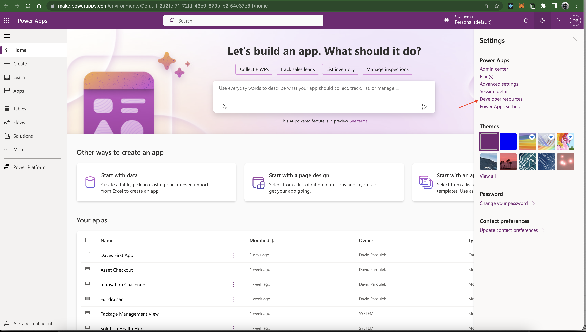
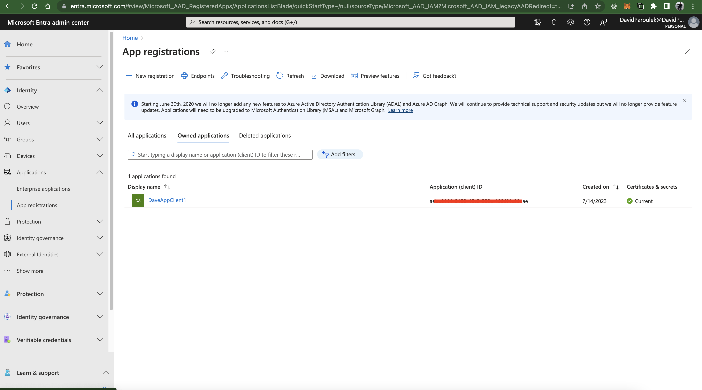
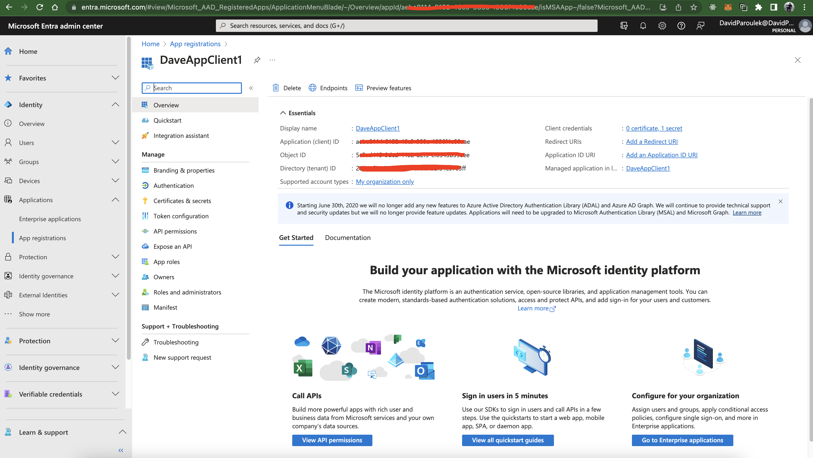
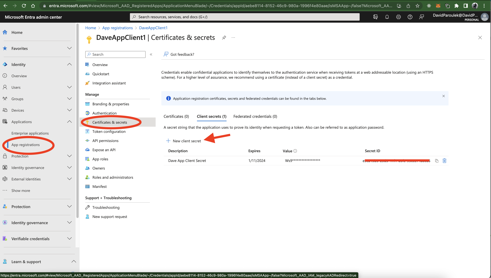
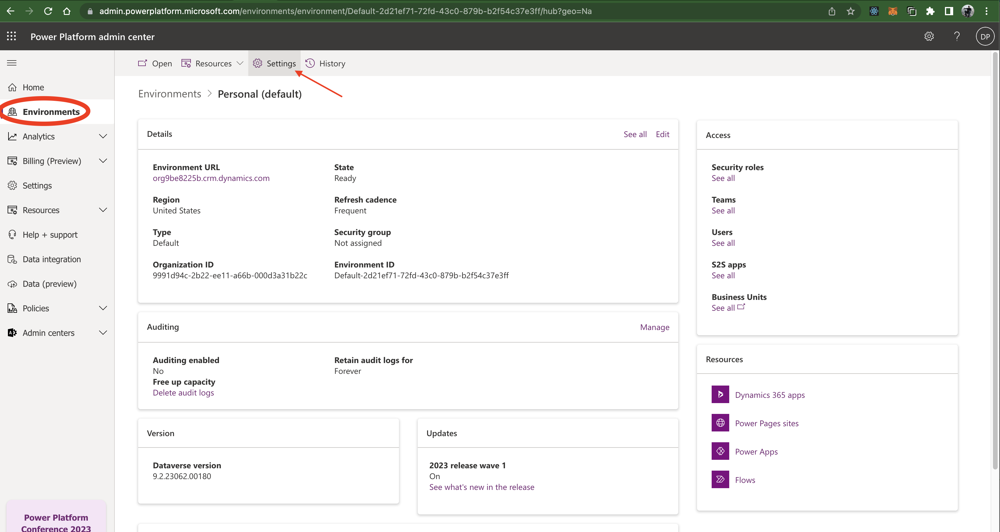
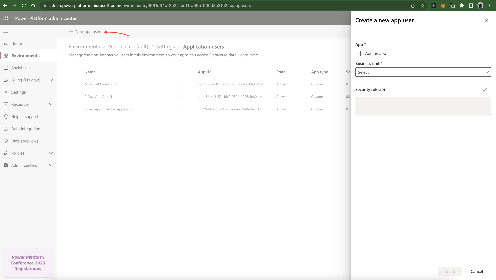
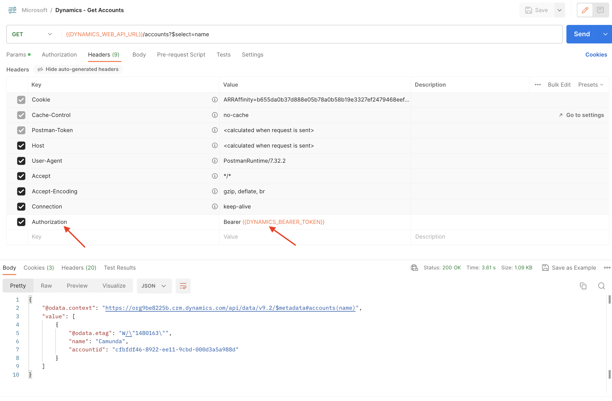
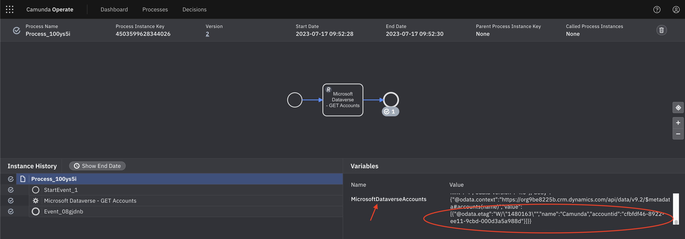

# Integrate Camunda 8 with Microsoft PowerApps Dataverse

This guide shows how to connect the [Camunda 8 Rest Connector](https://docs.camunda.io/docs/components/connectors/protocol/rest/) over Oauth2 to query data from Microsoft PowerApps Dataverse Tables.

## Prerequisites

- You'll need to have a Microsoft PowerApps Environment already available. For this demo, I was able to sign up for a free trial at [https://powerapps.microsoft.com](https://powerapps.microsoft.com)
- You'll need access to a Camunda 8 Environment. You can sign up for a free trial at [https://signup.camunda.com/](https://signup.camunda.com/)

## Find your Organization Id and Web API Endpoint

Browse to your PowerApps Environment URL, which will look something like this. (In my case, this environment was created when I signed up for a free Microsoft DataApps Trial. If you already have a corporate DataApps account, you may need to work with someone in your company with the authority to create this DataApps Environment for you.  

`https://make.powerapps.com/environments/<YOUR_ENVIRONMENT_ID>/home`

Click `Settings` -> `Developer Resources` in the upper right corner as shown here: 

The Developer Resources screen should show you your Organization Id and your Web App API Endpoint. My Web App API Endpoint looks like this: 

`https://<MY_ORG_ID>.api.crm.dynamics.com/api/data/v9.2`

## Create a Microsoft App Registration

There are several ways to accomplish this task. Here are the steps that worked for me: 

- Browse to [https://admin.microsoft.com/AdminPortal/Home#/homepage](https://admin.microsoft.com/AdminPortal/Home#/homepage)
- On the left navigation panel, click the link named `Identity` under `Admin Centers` to navigate to [https://entra.microsoft.com/](https://entra.microsoft.com/)
- On the left navigation panel, click the link named `Applications`, you should see a screen that looks like this:

- Click `New Registration`. Enter a name for your app registration, accept the defaults and click `Register`
- Click to edit your new App Registration. Note the information inside the `Overview` section. For example, here's what my screen looks like:

- Note the `Directory (tenant) ID` and `Application (client) ID`

## Create a client secret

- Click to view the App Registration you created in the previous step. 
- On the nested left navigation menu, click `Certificates & secrets`

- Click `New Client Secret`, enter a memorable description and click `Add`
- Remember to copy the `Value` of the secret (NOT the Secret ID)

## Gather endpoints

- Click to view the App Registration you created in the previous step.
- Click on `Endpoints` in the top bar menu. Copy the OAuth 2.0 token endpoint (v2). For example, mine looks like this: 
`https://login.microsoftonline.com/<MY_TENANT_ID>/oauth2/v2.0/token`

## Create App User in PowerPlatform

- Browse to the admin screen for powerplatform here: [https://admin.powerplatform.microsoft.com/](https://admin.powerplatform.microsoft.com/)
- Click `Environments`, choose your environment, and click `Settings`

- Click `Users and Permissions` -> `Application Users` and click `New App User`

- Select the app registration you created above and choose your organization

## Create Custom Role in PowerPlatform

- Navigate back to the admin screen for powerplatform here: [https://admin.powerplatform.microsoft.com/](https://admin.powerplatform.microsoft.com/)
- Click `Environments`, choose your environment, and click `Settings` (same as above)
- This time, select `Users + Permissions` and then select `Security Roles`

- Click to create a new Role
- Copy the `Basic User` role and then add additional permissions. 
- Edit the role and grant access to the individual tables

## Setup Postman

Figuring out which Microsoft PowerApps environment organization id, tenant id, app registration, roles, and oauth2 token urls was the most difficult part of setting this all up. I found it extremely useful to first use Postman to ensure I had the correct configuration to connect to Microsoft.

Once you can connect to Microsoft PowerApps from Postman, configuring the Camunda Rest Connector is straightforward. 

This post from microsoft was helpful: [Use Postman with the Web API](https://learn.microsoft.com/en-us/power-apps/developer/data-platform/webapi/use-postman-web-api)

First, I created a new `Environment` in Postman with all the details gathered above that looks like this: 

- Note that the `CLIENT_ID` is the `Application (client) ID` you gathered above
- Note that the `DYNAMICS_URL` is the host name from `WEB_API_URL` WITHOUT the `api` subdomain
- Also note that I'll describe how to get a bearer token below

### Create a PostMan Request to get a Bearer Token

Create a new request in Postman to send a `POST` request to the OAuth2 Token URL to get a bearer token. 

- Remember that the `OAuth2` token url looks something like this: `https://login.microsoftonline.com/<MY_TENANT_ID>/oauth2/v2.0/token`
- Note that `client_id` is the `Application (client) ID` gathered above
- The `grant_type` MUST be `client_credentials` for this to work in the Camunda 8 Rest Connector
- The `scope` should look something like this: `https://<MY_ORG_NAME>.crm.dynamics.com/.default`. (Note that you should NOT use the WEB API URL. This won't work: `https://<MY_ORG_NAME>.api.crm.dynamics.com/.default`)

Try submitting this request. A successful response should include an access token like this:

Copy that `access_token` and paste it as the value of the Postman Environment variable named `DYNAMICS_BEARER_TOKEN`

### Make a api request

- Create a new request in Postman to send at `GET` request to get all records from the Accounts table. The url will look something like this: 
`https://<MY_ORG_NAME>.crm.dynamics.com/api/data/v9.2/accounts?$select=name`
- Add a custom header named `Authorization`. The value of this header should be `Bearer <access_token>` as shown here:

## Configure Camunda HTTP Rest Connector

Now that all the details about connecting to Microsoft are out of the way, it should be easy to configure the Camunda REST Connector!

- Add a Camunda Rest Connector Task to a BPMN diagram
- Choose Authentication type `OAuth 2.0`
- Enter the same OAuth Token Endpoint as shown above when getting the bearer token. It will look similar to this: `https://login.microsoftonline.com/<TENANT_ID/oauth2/v2.0/token`
- Enter client id and secret with same values as used in Postman above
- Enter the same `scope` as in the postman example above. It will look like this: `https://<MY_ORG_NAME>.crm.dynamics.com/.default` 
- Make sure to select `Send as Basic Auth Header` as this is what Microsoft supports. 

- Now configure the GET request. The url should be something similar to this `https://<MY_ORG_NAME>.crm.dynamics.com/api/data/v9.2/accounts?$select=name`
- Don't forget to set a result variable name (or result expression depending on your requirements)

- Deploy and run your process and if all goes well, you should see results similar to the following:

