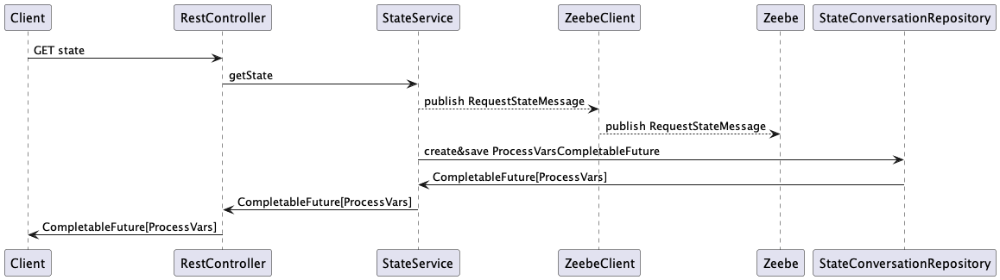
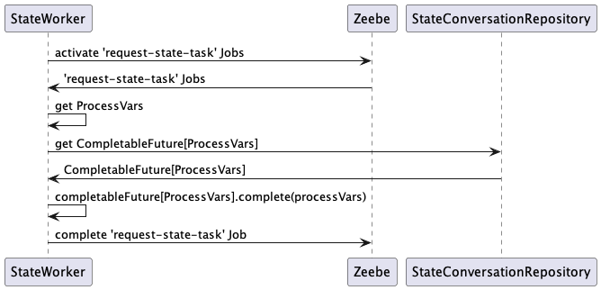

# Example how to request the current state from Zeebe

Since Zeebe implements CQRS, it doesn't offer an API to request the current state.
Operate does offer APIs to read Process Variables (https://docs.camunda.io/docs/apis-tools/operate-api/specifications/search/), but is eventual consistent.

This projects showcases an option to retrieve the current data from Zeebe via a non-interrupting event-based sub process.

## Run

### Prerequisite
- Cluster configured in application.yaml

### Run

Start process
```
curl -X POST http://localhost:8080/process/start -H "Content-Type: application/json" -d '{"myId": "42", myVar":"myValue"}'
```

Query state
```
curl http://localhost:8080/process/state/42 -H "Content-Type: application/json"
```


## How does it work?

### Sequence

0. Client Application retrieves REST Request to get current state from Zeebe
1. Client Application sends a Message "RequestStateMessage" with correlationKey "myId" to Zeebe
2. Client Application saves Reference in "StateConversationRepository" (in form of a CompletableFuture)
2. Zeebe retrieves that message and moves token to Message End Event with task "request-state-task"
3. JobWorker of type "request-state-task" activates Job and retrieves ProcessVars with activated Job
4. JobWorker of type "request-state-task" completes CompletableFuture from step 2
5. Client Application returns ProcessVars to Caller


### In BPMN


### Service POV


### JobWorker POV

