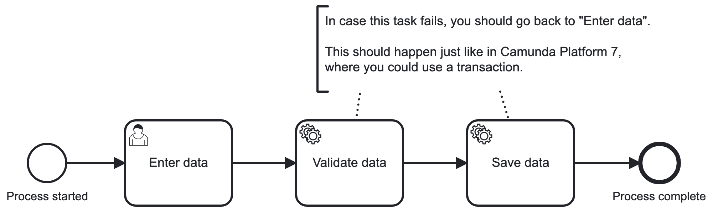

# Rollback on Error Example

## What is the use case?



After a user task, a validation can follow and possibly also saving data to a service.

These 2 actions might be required to be run synchronous.

While this was easy in Camunda Platform 7 (just leave out wait states), this is harder to achieve in an asynchronous environment.

However, it is still possible.

## How does it work?

The user task is activated by a job worker that is then transforming the user task, making it available to a service.

This service offers the user task and allows its completion.

On completion, the content of the header `rollbackOnError` is read and parsed to a list of strings, in this example `validateDataType, saveDataType` is parsed to

```json
[
  "validateDataType",
  "saveDataType"
]
```

The values of the array are the names of the process variables from which the next tasks read their job type from.

These values are generated and saved as variables.

Then, the job workers for the generated variable values are registered. Here, the job workers with the variable name as type are taken and dynamically re-registered.

Each of them is wrapped, so that a failed task (either by an exception thrown or a fail command) is propagated and the rollback to the initial user task is performed.

The result of the whole "transaction" is then returned from the method call `complete` (either as `void` or as thrown `RuntimeException`).

## How can I try it out?

Configure the zeebe connection in the `application.yaml`. By default, it points to a plaintext local zeebe gateway.

Then, start the app by running

```shell
mvn spring-boot:run
```

On starting up, the example process is deployed.

After the app is up and running, a process instance can be started with a  `POST` to `http://localhost:8080/start`.

Then, you will be able to retrieve tasks with a `GET` to `http://localhost:8080/task`.

To complete a task, you can `POST` to `http://localhost:8080/task/{key}/complete`. The body can contain 2 variables:

```json
{
  "validationFails": true,
  "savingFails": true
}
```

If `validationFails` is `true`, the validation task will fail.

If `savingFails` is `true`, the saving task will fail.

Both will result in the process instance being rolled back to the user task.

If one the variables is null, it is not applied and the task succeeds.
