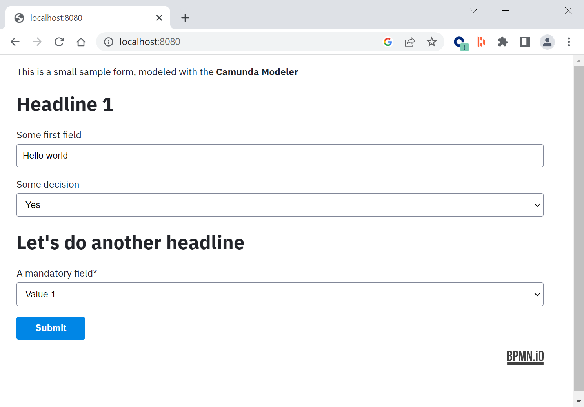

# Camunda 8 Spring Boot Example for Starting via Form



The self-contained process solution contains

* A sample [Camunda form](https://docs.camunda.io/docs/components/modeler/forms/camunda-forms-reference/)
* A simple HTML website using [form-js](https://bpmn.io/toolkit/form-js/) to render the form and submit it on request 
* REST endpoint to take the data from the form and start a process instance

Requirements:

* Camunda Platform 8
* Java >= 17
* Maven

## How to run

* Download/clone the code in this folder.
* Create a Camunda 8 SaaS cluster and add API client connection details in the file `application.properties`. Simply replace the existing sample values.
* Run the application:

```
mvn package exec:java
```

* Goto http://localhost:8080/