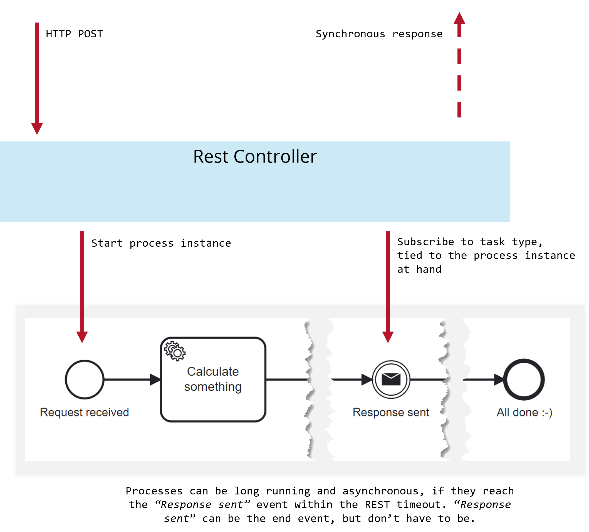
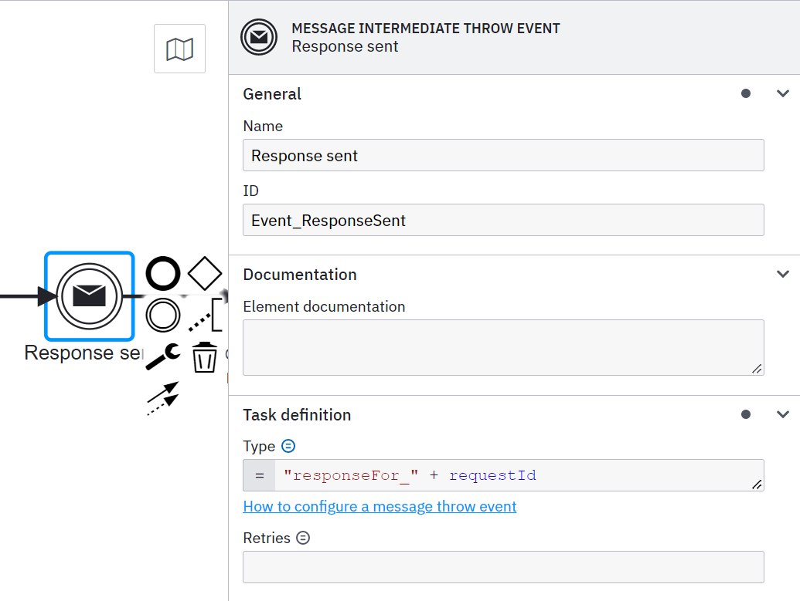

[](https://github.com/camunda-community-hub/community)

[](https://github.com/Camunda-Community-Hub/community/blob/main/extension-lifecycle.md#incubating-)

# Example for synchronous responses from processes

## What is this example all about?

When you start a process instance (or correlate a message to it), you might want to return some synchronous response, for example with a calculation result, or simply with an indication if something was successful (like an automatic approval) or not.

Camunda 8 works asynchronously under the hood, but it is actually easy to block for a certain state in the process from within your code. This is what this example shows.

The following image gives you an overview:



A REST controller starts a process instance and then will wait for the process to reach the message event "Response sent". This is implemented by creating a task type specific for this one process instance. This can be achieved by leveraging the FEEL expression language and a process variable:




```
= "responseFor_" + requestId
```

Now you can create a [job worker]() on the fly to subscribe to only the job of the process instance with exactly this requestId:

```java
String jobType = "responseFor_" + requestId;
JobWorker worker = zeebe.newWorker().jobType(jobType)
//...
worker.close();
```

In this example, this is used in the context of Webflux to indicate success towards the Mono of Webflux, as you can see in the [REST controller](src/main/java/org/example/camunda/process/solution/facade/ProcessController.java)

```java
return Mono.create(sink -> {
    // define a unique job type just for this conversation
    String jobType = "responseFor_" + requestId;
    // And start a worker for it
    JobWorker worker = zeebe.newWorker()
          .jobType(jobType)
          .handler((client, job) -> {
              String response = (String)job.getVariablesAsMap().get("response");
              LOG.info(".. finished with response: `" + response + "`");

              // When the job is there, read the response payload and return our response via the Mono
              sink.success(response);

              // Make sure to complete the job (ignoring exceptions for now)
              client.newCompleteCommand(job).send();
          })
          .name(jobType)
          .open();
    // Make sure this worker is closed once the response was received
    sink.onDispose(() -> worker.close());
});
```

## Run this example

The application requires a running Zeebe engine, best use the Camunda SaaS offering. See also [recommended deployment options for Camunda Platform](https://docs.camunda.io/docs/self-managed/platform-deployment/#deployment-recommendation.).

Run the application via
```
./mvnw spring-boot:run
```

Then

```
curl -X POST http://localhost:8080/process/start
```
